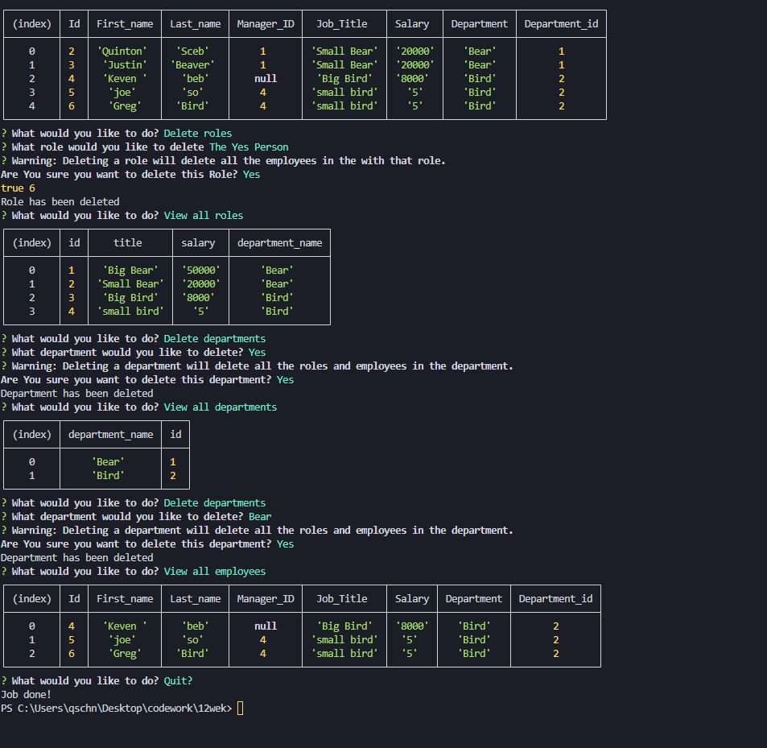

 
# UW-BootCamp-Week12-Bisnus-Dadabase

## Description

I created this aplacation as a skelaton for database interaction. This should provide me with an easly adjustable outline for any database and database function I could come by in the future. The Focus was creating a working outline with a business as the practice aplacation. I learned how to better use and understans classes and sql elements durring the creation of this project.

## Table of Contents (Optional)

- [Installation](#installation)
- [Usage](#usage)
- [Credits](#credits)
- [License](#license)

## Installation

To run this aplacation run a npm i after downloading the package.json with the rest of the code, then download and start a mysql server. After that create a .env file with the Db name, the db password, and db user. The formatting can be found in the dot connection.js folder, or by using google. after that just run a node ./index.js when your directory is in the right folder and have fun.

## Usage

To use this aplacation follow the install, otherwise every function is explaned by the propt and are very streight forward to follow.
Viedo example:https://youtu.be/BFBfhpnZrlQ
;

## License

Copyright 2023, h

    Permission is hereby granted, free of charge, to any person obtaining a copy of this software and associated documentation files (the “Software”), to deal in the Software without 
    restriction, including without limitation the rights to use, copy, modify, merge, publish, distribute, sublicense, and/or sell copies of the Software, and to permit persons to whom 
    the Software is furnished to do so,subject to the following conditions:
    The above copyright notice and this permission notice shall be included in all copies or substantial portions of the Software.
    THE SOFTWARE IS PROVIDED “AS IS”, WITHOUT WARRANTY OF ANY KIND, EXPRESS OR IMPLIED, INCLUDING BUT NOT LIMITED TO THE WARRANTIES OF MERCHANTABILITY, FITNESS FOR A PARTICULAR PURPOSE 
    AND NONINFRINGEMENT. IN NO EVENT SHALL THE AUTHORS OR COPYRIGHT HOLDERS BE LIABLE FOR ANY CLAIM, DAMAGES OR OTHER LIABILITY, WHETHER IN AN ACTION OF CONTRACT, TORT OR OTHERWISE, 
    ARISING FROM, OUT OF OR IN CONNECTION WITH THE SOFTWARE OR THE USE OR OTHER DEALINGS IN THE SOFTWARE.
(https://opensource.org/licenses/MIT)
